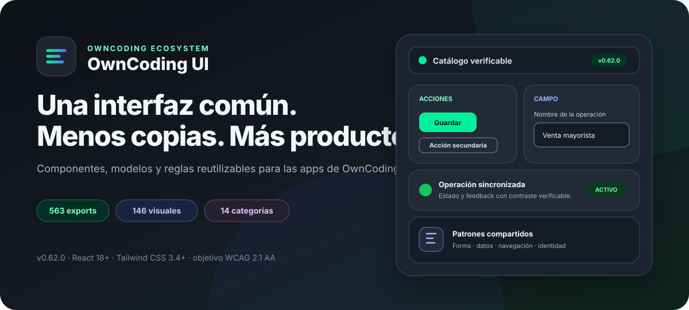
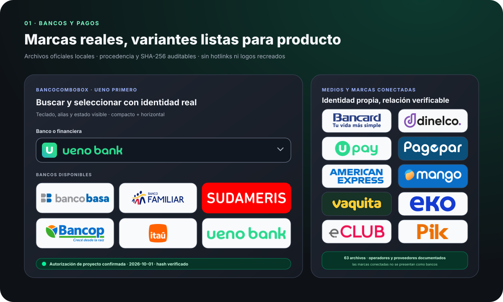
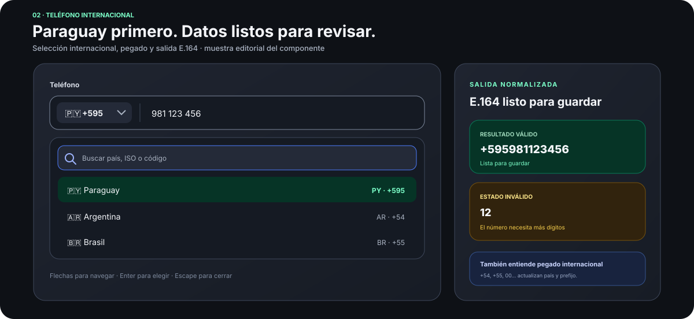
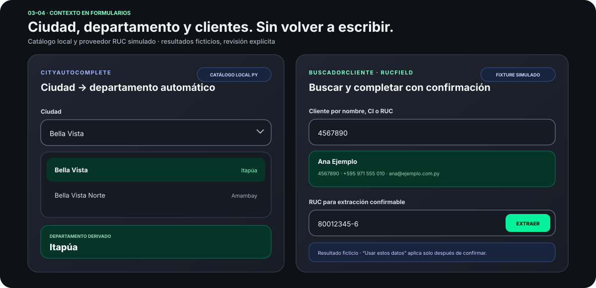
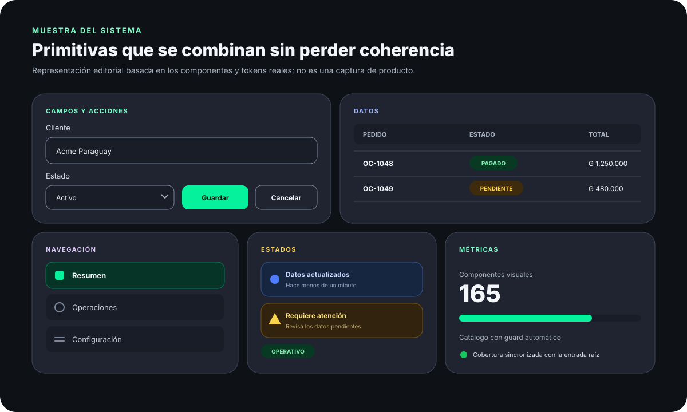
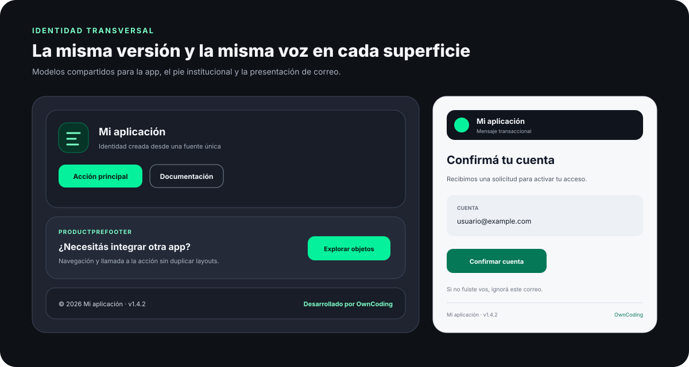

<p align="center">
  
</p>

<h1 align="center">OwnCoding UI</h1>

<p align="center">
  Componentes, modelos y reglas de interfaz para construir las aplicaciones de OwnCoding<br />
  con una base consistente, accesible y verificable.
</p>

<p align="center">
  <a href="https://github.com/dariodeoli/owncoding-ui/actions/workflows/ci.yml"></a>
  
  
  
</p>

<p align="center">
  <strong><a href="https://controlaria.online">Galería publicada</a></strong>
  · <a href="docs/ADOPCION.md">Adopción</a>
  · <a href="docs/REGLAS.md">Reglas</a>
  · <a href="docs/ACCESIBILIDAD.md">Accesibilidad</a>
  · <a href="CHANGELOG.md">Changelog</a>
</p>

> **Estado verificado el 2026-10-02:** la galería está publicada en HTTPS en
> [controlaria.online](https://controlaria.online), con respuesta HTTP 200 y
> [status.json](https://controlaria.online/status.json) indicando versión `0.62.0`
> y build `8011af3b3cba84747b41b989bec3ca987529efc0`. Esta evidencia no implica
> cobertura completa de instituciones ni activación de servicios externos: las
> demostraciones usan fixtures locales. Para ejecutarla localmente: `npm run gallery:dev`.

## Primero: las automatizaciones de mayor valor

El recorrido visual empieza por los campos que más trabajo manual evitan en
aplicaciones paraguayas. Todos son componentes reales de la biblioteca; las
imágenes son representaciones editoriales, no capturas inventadas de una app.

### 1. Bancos y medios de pago

<p align="center">
  
</p>

`BancoCombobox`, `BancoLogo` y `MedioPagoLogo` renderizan archivos oficiales
locales en variantes `compacto` y `horizontal`. ueno bank abre la selección;
Bancard, Dinelco, upay, Pagopar y las demás marcas disponibles conservan su
geometría original. Mango, Vaquita, EKO, eCLUB y Pik se muestran como marcas
propias conectadas con su institución o proveedor financiero verificado, sin
convertirlas en bancos ni sustituir una identidad por otra. Cada archivo registra fuente, fecha, SHA-256 y la
autorización escrita proporcionada para este repositorio público y la web de
Own UI. No se declara una licencia abierta ni un permiso universal.

### 2. Teléfono mobile con Paraguay por defecto

<p align="center">
  
</p>

`PhoneField` abre en 🇵🇾 Paraguay con `+595`, permite buscar país o prefijo,
interpreta pegado internacional y entrega la salida E.164 junto con su estado
de validación.

### 3–4. Ciudad/departamento y clientes por CI/RUC

<p align="center">
  
</p>

`CityAutocomplete` deriva el departamento desde el catálogo local de Paraguay.
`BuscadorCliente` encuentra fixtures por nombre, contacto, CI o RUC, y
`RucField` admite escritura y pegado numéricos: elimina letras y separadores
ajenos al formato y coloca el guion antes del noveno dígito cuando no se ingresó.
La extracción sigue siendo **simulada y confirmable**, con tres empresas demo
y resolución determinista por RUC; los resultados se rotulan como ficticios.
La galería no consulta un proveedor real ni afirma que una CI se convierta
universalmente en RUC. `ImeiField` completa la familia de seriales: valida el
IMEI de 15 dígitos con Luhn en vivo, limpia lo que se escribe o pega (solo
dígitos), avisa cuántos faltan y, si el dígito control no cierra, deja el error
junto al campo; con `revisando` muestra el estado de la consulta externa sin
adelantar el resultado.

| Orden estable de la galería | Export principal | Preview ID |
| ---: | --- | --- |
| 1 | `BancoCombobox` | `bancos-pagos` |
| 2 | `PhoneField` | `telefono-py` |
| 3 | `CityAutocomplete` | `ciudad-departamento` |
| 4 | `RucField` | `cliente-ci-ruc` |

## Por qué existe

OwnCoding UI evita que cada producto vuelva a resolver botones, formularios,
estados, navegación, identidad o formatos por separado. La regla es simple:
**buscar antes de crear**. Si el patrón ya existe, se reutiliza; si falta, se
incorpora aquí y luego se adopta mediante una versión fija.

- **Portable:** los componentes reciben props y callbacks; no hacen `fetch`,
  no leen stores y no conocen el router de la aplicación.
- **Consistente:** tokens, contratos y patrones compartidos sustituyen copias
  locales que se desvían con el tiempo.
- **Paraguay primero, internacional cuando corresponde:** guaraníes, RUC,
  bancos, impresión y teléfono `+595` forman parte del sistema.
- **Verificable:** pruebas, tipos de consumidor, paquete instalable, límites de
  bundle y cobertura de galería se validan antes de publicar.

## Catálogo actual

El inventario se deriva de `src/index.js` y se comprueba contra
`gallery/catalog.js`; no son números estimados.

| Cobertura | Cantidad |
| --- | ---: |
| Exports de la entrada raíz | **590** |
| Exports visuales | **168** |
| API, modelos y utilidades | **422** |
| Vistas curadas con fixtures controlados | **168** |
| Categorías del catálogo | **14** |

La galería nunca ejecuta un export arbitrario por nombre. Cada vista visual
está asociada explícitamente a un fixture aprobado y el resto aparece como
ficha consultable.

## Áreas del sistema

| Área | Incluye |
| --- | --- |
| Primitivas y formularios | `Button`, `Input`, `FormField`, `MoneyInput`, `PercentField`, `SearchField`, `Select`, `Textarea`, `Switch` y más |
| Datos y feedback | tablas responsivas, badges, avisos, estados vacíos, skeletons, progreso, cronologías y tableros |
| Navegación y overlays | shell, tabs, menús, paneles, diálogos y paleta de comandos con contratos de teclado |
| Finanzas y pagos | catálogos puros, `BancoCombobox`, `BancoLogo`, `MedioPagoLogo`, monedas y cuentas de cobro |
| Teléfono y países | Paraguay `+595` por defecto, selector internacional buscable, pegado internacional y salida E.164 |
| Identidad de aplicación | versión estricta, prefooter opcional, footer institucional y presentación de correo transaccional |
| Carga con IA | asistente declarativo con confirmación humana y motor server opcional en `owncoding-ui/ia` |
| Operación e impresión | inventario, dispositivos, documentos, QR, tickets ESC/POS y estado de impresoras |

### Después: el resto del sistema

Los previews prioritarios no ocultan el catálogo completo. Después aparecen
moneda, porcentaje, correo, fechas, seriales y el resto de primitivas, datos,
estados, navegación e identidad. Las fichas individuales incorporan 38 demos
adicionales de acceso, navegación, personas y operación: estado local, bandejas
vacías, formularios y confirmación explícita, sin servicios ni persistencia.

<p align="center">
  
</p>

Las marcas financieras declaran procedencia, fecha, SHA-256, estado y cobertura.
Los assets verificados se empaquetan localmente. `v0.61.1` completa ambas
presentaciones de Continental, Citi, Itaú, Tu Financiera, GNB, Universitaria y
San Cristóbal: las marcas reutilizadas se describen como **contenidas**, no
como símbolos o lockups independientes. GNB y San Cristóbal incorporan además los compactos originales
proporcionados por el usuario, sin editar sus bytes ni atribuirles una URL oficial. Banco do Brasil queda excluido del catálogo seleccionable por decisión del
usuario (no por una afirmación de licencia revocada). Su lookup histórico
conserva el bloqueo de calidad: su favicon oficial de 48px no alcanza el mínimo de 64px y no se
verificó un lockup horizontal bancario. No se amplía ni inventa un logo para
completarlo. La autorización documentada se limita al repositorio y web/galería
OwnCoding; no se presenta como licencia abierta. Consulta el manifiesto y el
contrato en
[`docs/MARCAS-FINANCIERAS.md`](docs/MARCAS-FINANCIERAS.md) y
[`docs/financial-assets-manifest.json`](docs/financial-assets-manifest.json).

## Inicio rápido

### 1. Instalar una versión fija

La versión del paquete es `v0.66.0`. Al publicar su tag, la instalación fija es:

```bash
npm install github:dariodeoli/owncoding-ui#v0.66.0
```

Para probar la rama principal sin fijar un release:

```bash
npm install github:dariodeoli/owncoding-ui
```

Requisitos de consumo: **Node.js 18+**, **React 18+** y **Tailwind CSS 3.4+**.
El repositorio es público, pero el paquete figura como `UNLICENSED` y se instala
desde Git; no se anuncia como publicado en npm ni bajo una licencia open source.

### 2. Configurar Tailwind

```js
// tailwind.config.js
import preset, { owncodingContent } from 'owncoding-ui/tailwind-preset'

export default {
  presets: [preset],
  // Tailwind 3.4 ignora el content de un preset: debe agregarse aquí.
  content: [...owncodingContent, './src/**/*.{js,jsx,ts,tsx}'],
}
```

### 3. Importar estilos

```css
@tailwind base;
@tailwind components;
@tailwind utilities;

/* Tokens + base global */
@import 'owncoding-ui/styles.css';
```

Una aplicación con diseño propio puede importar únicamente variables con
`owncoding-ui/tokens.css`, o sumar la base de manera explícita con
`owncoding-ui/base.css`. Consulta las diferencias y el rollback en la
[`guía de adopción`](docs/ADOPCION.md).

### 4. Usar componentes

```jsx
import 'owncoding-ui/styles.css'
import { Aviso, Button, Card, Money, PhoneField } from 'owncoding-ui'

export function Resumen({ total, telefono, setTelefono, guardar }) {
  return (
    <Card className="space-y-4">
      <Aviso tono="info">Los datos están listos para revisar.</Aviso>
      <Money value={total} />
      <PhoneField phone={telefono} onChange={setTelefono} />
      <Button onClick={guardar}>Guardar</Button>
    </Card>
  )
}
```

## Entradas granulares

Las pantallas no necesitan pagar el costo del barrel completo. Los subpaths
separan UI, metadata pura y renderizadores de servidor:

```js
import { crearIdentidadApp } from 'owncoding-ui/app-identity'
import { motorIA } from 'owncoding-ui/ia'
import { renderCorreoHtml } from 'owncoding-ui/email'
import { BancoLogo, MedioPagoLogo } from 'owncoding-ui/financial'
import { LOGOS_BANCOS } from 'owncoding-ui/financial-metadata'
import { PhoneField } from 'owncoding-ui/phone'
import { formatGs, fechaDia } from 'owncoding-ui/utils'
```

| Entrada | Entorno | Responsabilidad |
| --- | --- | --- |
| `owncoding-ui` | cliente React | superficie compatible completa |
| `owncoding-ui/ia` | servidor/universal | motor OpenAI-compatible, validación y rate-limit sin React |
| `owncoding-ui/phone` | cliente React | campo telefónico y UI de países |
| `owncoding-ui/financial` | cliente React | logos locales, variantes, resolvers y manifest visual autorizado |
| `owncoding-ui/financial-metadata` | universal | registros puros, sin bytes de imágenes |
| `owncoding-ui/app-identity` | universal | identidad y versión estricta |
| `owncoding-ui/email` | servidor/universal | modelo y HTML/texto escapados; no envía |
| `owncoding-ui/utils` | servidor/universal | formatos y lógica pura sin React |

## Carga con IA

`CargaIA`, `BotonCargaIA` y `DialogoCargaIA` convierten texto libre en una
revisión editable, pero **nunca crean registros sin confirmación humana**. La
aplicación aporta un esquema declarativo y los callbacks `analizar`/`crear`; la
UI no hace `fetch`, no conoce permisos y no persiste el texto pegado.

```jsx
import { CargaIA } from 'owncoding-ui'

<CargaIA
  esquema={esquema}
  consultarConfig={() => api.get('/api/ia/carga')}
  analizar={(texto, tipos) => api.post('/api/ia/carga', { texto, tipos })}
  crear={(registros) => api.post('/api/ia/crear', { registros })}
/>
```

El subpath `owncoding-ui/ia` agrega el motor server opcional, salida JSON
estricta, prompt anti-inyección, validación contra el esquema y rate-limit. Sin
`IA_API_KEY` queda apagado con un estado explícito; no sustituye los permisos,
el aislamiento por empresa ni la auditoría de la app. Contrato completo:
[`docs/REGLAS.md` §18](docs/REGLAS.md#18-carga-con-ia-1112).

El diálogo se adapta al contenido (#16): entrada y resultado abren en `amplio`
(`max-w-3xl`) y la revisión pide `completo` recién con varias tarjetas o tipos
densos; la prop aditiva `size` fija el ancho. El textarea tiene alto acotado y
el contador va en la fila del hint, así el popup no deja espacio muerto.

## Identidad, footer y correo

La versión visible debe provenir de una sola fuente de la aplicación. No se
lee automáticamente el `package.json` consumidor ni se mantiene un literal por
pantalla.

```jsx
import {
  ProductFooter,
  ProductPrefooter,
  crearIdentidadApp,
} from 'owncoding-ui'

const app = crearIdentidadApp({
  nombre: 'Mi aplicación',
  version: APP_VERSION,
  url: 'https://app.example.com',
})

export function PieDePagina() {
  return (
    <>
      <ProductPrefooter
        modelo="completo"
        columnas={[
          { titulo: 'Producto', enlaces: [{ href: '/estado', etiqueta: 'Estado' }] },
        ]}
        accion={{
          titulo: '¿Necesita ayuda?',
          enlace: { href: '/soporte', etiqueta: 'Contactar' },
        }}
      />
      <ProductFooter
        identidad={app}
        modelo="distribuido"
        enlaces={[{ href: '/privacidad', etiqueta: 'Privacidad' }]}
      />
    </>
  )
}
```

```js
import {
  crearCorreoTransaccional,
  renderCorreoHtml,
  renderCorreoTexto,
} from 'owncoding-ui/email'

const correo = crearCorreoTransaccional({
  identidad: app,
  asunto: 'Confirme su cuenta',
  motivo: 'Recibimos una solicitud para activar su acceso.',
  accion: { etiqueta: 'Confirmar cuenta', url: enlaceFirmado },
})

const html = renderCorreoHtml(correo)
const texto = renderCorreoTexto(correo)
```

El subpath de correo solo resuelve presentación segura. Relay WEEM,
credenciales, enlaces firmados, cola, reintentos, tracking y confirmación de
entrega pertenecen al backend.

<p align="center">
  
</p>

Guía completa:
[`docs/IDENTIDAD-APP-Y-CORREO.md`](docs/IDENTIDAD-APP-Y-CORREO.md).

## Accesibilidad y soporte

OwnCoding UI tiene como objetivo **WCAG 2.1 AA**. Los contratos compartidos
incluyen foco visible, áreas táctiles, mensajes asociados a campos, navegación
de teclado en comboboxes, tabs y menús, manejo de foco en overlays, regiones
vivas y reducción de movimiento.

| Contrato | Alcance verificado |
| --- | --- |
| React | `>=18` como peer dependency |
| Tailwind CSS | preset y contenido para `3.4+` |
| Node.js | `>=18` para consumo/build; la galería en Hub usa Node 24 |
| Navegador | APIs web modernas; no se declara soporte para Internet Explorer |
| Temas | claro, oscuro y consola mediante tokens |
| Accesibilidad | pruebas automatizadas y contratos documentados; requieren smoke manual con teclado y lector de pantalla en cada aplicación |

La matriz de interacción está en
[`docs/ACCESIBILIDAD.md`](docs/ACCESIBILIDAD.md). La automatización no sustituye
una pasada manual con VoiceOver/NVDA ni la validación del flujo completo en la
aplicación consumidora.

## Documentación

<details>
<summary><strong>Adopción y sistema visual</strong></summary>

- [Adoptar la biblioteca](docs/ADOPCION.md)
- [Adopción progresiva del sistema v2](docs/ADOPCION-V2.md)
- [Tokens e iconos v2](docs/V2.md)
- [Shell y navegación](docs/SHELL.md)
- [Migración de pantallas](docs/MIGRACION-V2.md)
- [Galería y despliegue](docs/GALERIA.md)

</details>

<details>
<summary><strong>Reglas y contratos especializados</strong></summary>

- [Reglas de interfaz](docs/REGLAS.md)
- [Reglas del ecosistema](docs/REGLAS-ECOSISTEMA.md)
- [Accesibilidad](docs/ACCESIBILIDAD.md)
- [Marcas financieras](docs/MARCAS-FINANCIERAS.md)
- [Identidad, footer y correo](docs/IDENTIDAD-APP-Y-CORREO.md)
- [Impresión](docs/IMPRESION.md)

</details>

<details>
<summary><strong>Mantenimiento</strong></summary>

- [Alimentar la biblioteca](docs/ALIMENTAR.md)
- [Modos de trabajo](docs/MODOS-DE-TRABAJO.md)
- [Comandos operativos](docs/COMANDOS.md)
- [Historial de cambios](CHANGELOG.md)

</details>

## Versionado y compatibilidad

- `v0.x` identifica una biblioteca aún en formación; un cambio de nombre se
  documenta y requiere una ruta de migración.
- Cada release actualiza `package.json`, `CHANGELOG.md`, artefactos de `dist/`
  y el tag `vX.Y.Z`.
- Las aplicaciones consumen una versión fija. Adoptar una versión nueva es un
  cambio explícito de la aplicación y debe pasar sus propios checks.
- Un alias `@deprecated` permanece al menos dos releases menores publicadas.
- Ningún export se elimina sin auditoría de uso en el ecosistema, guía de
  migración y entrada de changelog.

## Desarrollo y verificación

```bash
npm ci
npm test
npm run test:types
npm run gallery:check
npm run gallery:build
npm run test:package
npm run check:bundle
npm run readme:check
git diff --check
```

La galería local se inicia con:

```bash
npm run gallery:dev
```

### Estructura

```text
src/components/    componentes visuales portables
src/utils/         lógica pura compartida
src/financial/     gate de redistribución y resolución financiera segura
src/email/         modelo y renderizadores de correo
src/styles/        tokens, base global opcional y estilos completos
types/             declaraciones públicas del paquete
gallery/           catálogo React con fixtures controlados
docs/              contratos, adopción y operación
test/              comportamiento, tipos, paquete y regresiones
dist/              artefactos versionados de distribución
```

Antes de incorporar un componente, confirma que no exista un patrón equivalente
y sigue [`docs/ALIMENTAR.md`](docs/ALIMENTAR.md). La biblioteca debe resolver
interfaz compartida; la lógica de negocio continúa en cada producto.

El catálogo ofrecido contiene 32 instituciones: Banco do Brasil se excluye por
curaduría del usuario; sus aliases y metadatos históricos siguen disponibles.
Esta selección no representa el padrón completo de entidades supervisadas.

La ampliación de documentos y revisión suma 25 demos reales: ajustes y estados
de impresión simulada, hoja y papel aislado, certificado, manifiesto, etiqueta,
seriales, consentimiento, revisión y lotes. Ningún control envía trabajos de
impresión, consulta dispositivos, sube datos o persiste cambios.

El grupo ofrece 13 cooperativas con originales verificables y variantes
contenidas explícitas cuando no existe un símbolo o lockup independiente.
Capiatá, Ñemby y Lambaré ya se incorporan; 24 de Octubre y Tobatí siguen
bloqueadas por calidad sin recortar ni reconstruir imágenes. San Lorenzo usa
su compacto oficial también como marca contenida horizontal. Visa y Mastercard
usan originales públicos de primera parte. Pix incorpora conversiones de los
PDF vectoriales oficiales del BCB; Red Infonet y Panal incorporan recortes
solo de márgenes transparentes autorizados. Los originales y las recetas se
conservan en `docs/financial-originals/`; uPOS mantiene su presentación
explícita de producto padre, sin inventar una marca independiente.

El build visual comparte los data URLs en un único chunk ESM, conservando
importación síncrona y SSR Node sin URLs de archivo. La deduplicación es física
al empaquetar, no una promesa de menor tráfico al importar el barrel. Los límites
totales del paquete permanecen sin cambios; consulte BUNDLE-BUDGETS.md.

## Componentes reutilizables ampliados

Headers públicos y administrativos, perfiles y cambio de cuenta, Combobox simple/múltiple, Popover/Tooltip accesibles, cierre protegido, centro de notificaciones, acciones asíncronas, copia, barra de acciones y modelos de pie. [Contratos y ejemplos](docs/REUSABLE-UI.md). Son UI controlada: no implementan autenticación ni servicios externos.

### Movimiento reutilizable (opt-in)

`AnimatedStatus` anuncia estados controlados; `MotionSurface` compone tarjetas y
controles existentes sin cambiar su semántica. [Contrato y adopción](docs/MOTION.md).
Las nuevas vistas son fixtures locales, no integraciones con servicios.

`OtpVerification` compone el PIN compartido y feedback de estado; la app controla
verificación, resultado y cooldown. [Contrato OTP](docs/OTP-VERIFICATION.md).

`Carousel` presenta contenido controlado con navegación manual accesible, sin
autoplay ni swipe. [Contrato de carrusel](docs/CAROUSEL.md).

`CartSummary` presenta cantidades e importes controlados por la app, sin calcular
precios ni ejecutar pagos. [Contrato](docs/CART-SUMMARY.md).

`ProductVariantSelector` emite selecciones controladas contra una matriz de
disponibilidad aportada por la app. [Contrato](docs/PRODUCT-VARIANT-SELECTOR.md).

`PricingCard` presenta planes y precios provistos por la app, con selección
explícita sin contratos ni cobros locales. [Contrato](docs/PRICING-CARD.md).
